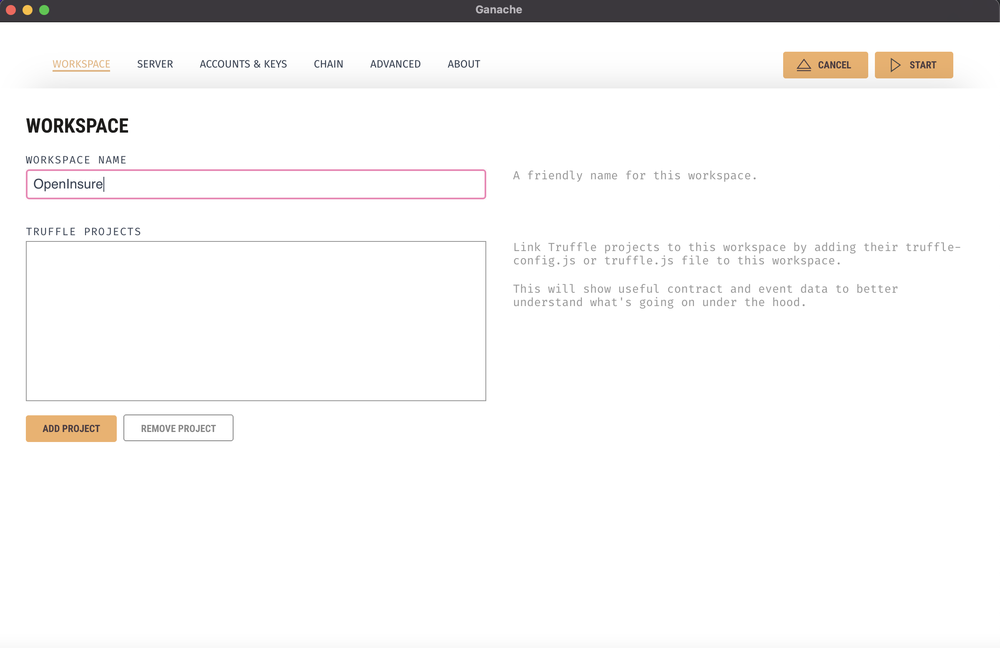
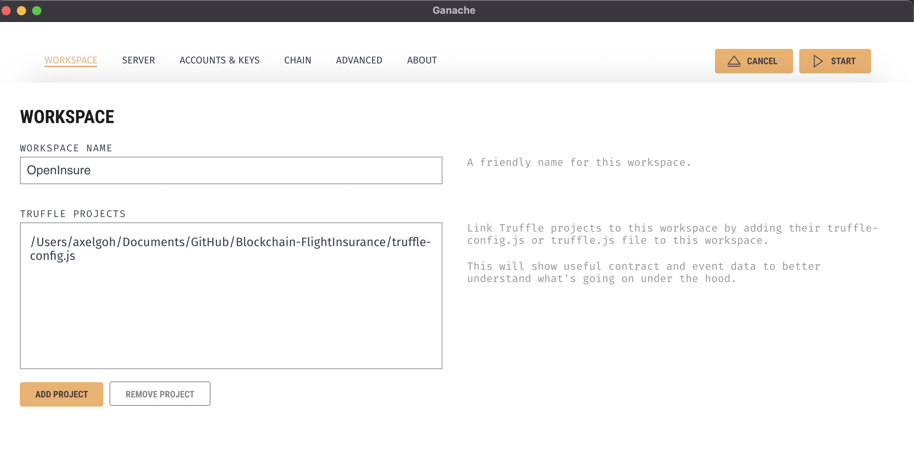
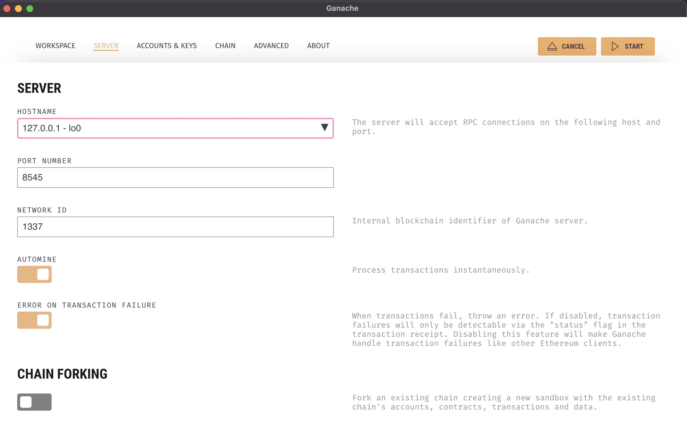
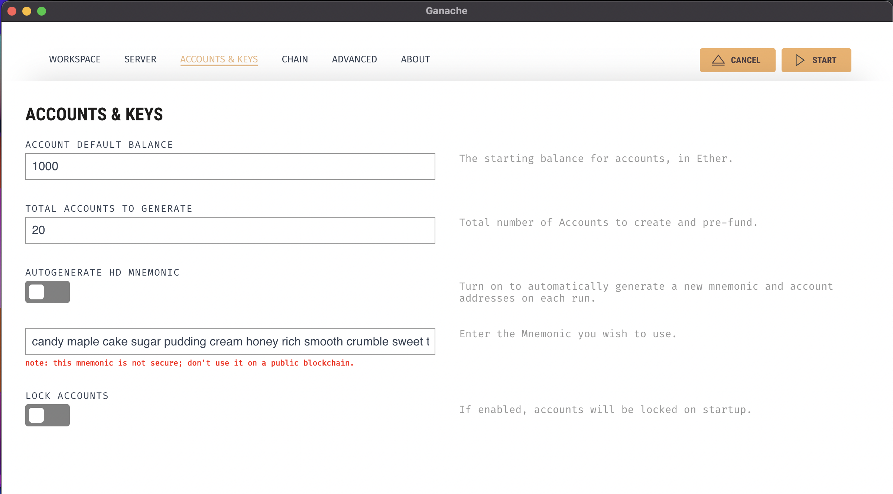
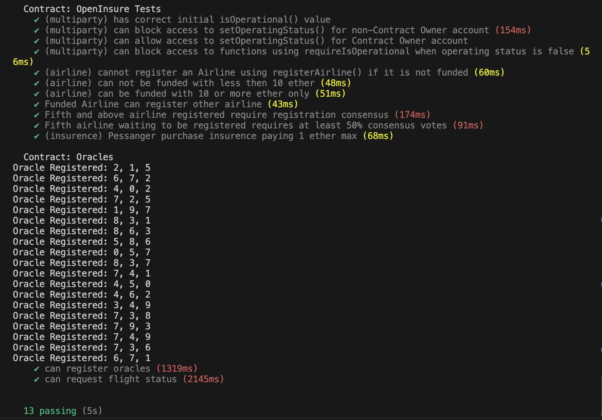
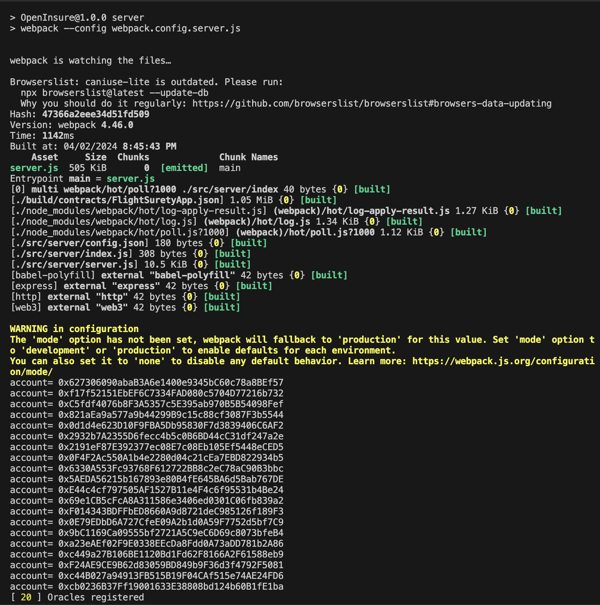
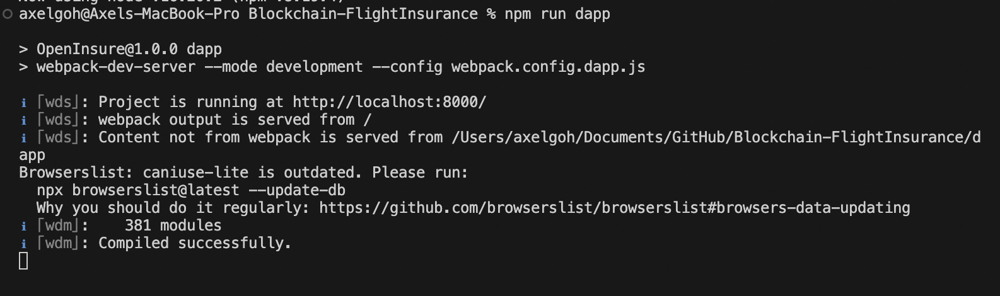

# OpenInsure Dapp

This repository contains OpenInsure, a Decentralised Flight Insurance Platform that helps to eliminate middleman and make claiming of flight insurance a smooth process.

# Requirements to Run
Please ensure that you are using the specific libraries and versions in order to run this project.

| Library/Module/Tool | Version | Description
|---|---|---|
| *Truffle* | v5.11.5 (core: 5.11.5) | Our Environment to run Blockchain
| *Solidity* | - 0.8.19 (solc-js) | Our language for implementing smart contracts in Ethereum
| *Node* | v16.20.2 | JavaScript runtime to run our application
| *Web3.js* | v1.10.0 | Libraries to interact with a local or remote ethereum node using HTTP, IPC or WebSocket.
| *webpack* | v4.6.0 | To create the Dapp UI and simulate Oracles server
| *ganache-cli* | v7.9.1 | Our Local ethereum blockchain emulator
| *Metamask Extension* | No fixed version | To be used when interacting with our dAPP

# Installation
To ensure a smooth process, please ensure you have `NPM` and `NVM` if needed to install our dependencies based on the version we are using.

All commands will be run based in the Folder Directory.

Run the following to install dependencies from our package.json
```bash
npm install
```

To ensure all dependencies and libraries are supported in the Project, please run this code. (If there is an issue with the test, please ensure your solc version is 0.8.19)
```bash
truffle compile
```
Now to create an instance of our Ethereum Blockchain environment, run this code. Please do ensure the mnemonic phrase is the same.
```bash
ganache-cli -a 20 -l 9999999 -m "candy maple cake sugar pudding cream honey rich smooth crumble sweet treat"
```

Based on that, we will have a total of 20 accounts to be used for test, however the index(0) will be the Contract Owner.

For your reference to be used in your MetaMask:
```text
Available Accounts
==================
(0) 0x627306090abaB3A6e1400e9345bC60c78a8BEf57
(1) 0xf17f52151EbEF6C7334FAD080c5704D77216b732
(2) 0xC5fdf4076b8F3A5357c5E395ab970B5B54098Fef
(3) 0x821aEa9a577a9b44299B9c15c88cf3087F3b5544
(4) 0x0d1d4e623D10F9FBA5Db95830F7d3839406C6AF2
(5) 0x2932b7A2355D6fecc4b5c0B6BD44cC31df247a2e
(6) 0x2191eF87E392377ec08E7c08Eb105Ef5448eCED5
(7) 0x0F4F2Ac550A1b4e2280d04c21cEa7EBD822934b5
(8) 0x6330A553Fc93768F612722BB8c2eC78aC90B3bbc 
(9) 0x5AEDA56215b167893e80B4fE645BA6d5Bab767DE 
(10) 0xE44c4cf797505AF1527B11e4F4c6f95531b4Be24 
(11) 0x69e1CB5cFcA8A311586e3406ed0301C06fb839a2 
(12) 0xF014343BDFFbED8660A9d8721deC985126f189F3 
(13) 0x0E79EDbD6A727CfeE09A2b1d0A59F7752d5bf7C9 
(14) 0x9bC1169Ca09555bf2721A5C9eC6D69c8073bfeB4 
(15) 0xa23eAEf02F9E0338EEcDa8Fdd0A73aDD781b2A86 
(16) 0xc449a27B106BE1120Bd1Fd62F8166A2F61588eb9 
(17) 0xF24AE9CE9B62d83059BD849b9F36d3f4792F5081 
(18) 0xc44B027a94913FB515B19F04CAf515e74AE24FD6 
(19) 0xcb0236B37Ff19001633E38808bd124b60B1fE1ba

Private Keys to export to metamask to test
==================
(0) 0xc87509a1c067bbde78beb793e6fa76530b6382a4c0241e5e4a9ec0a0f44dc0d3
(1) 0xae6ae8e5ccbfb04590405997ee2d52d2b330726137b875053c36d94e974d162f
(2) 0x0dbbe8e4ae425a6d2687f1a7e3ba17bc98c673636790f1b8ad91193c05875ef1
(3) 0xc88b703fb08cbea894b6aeff5a544fb92e78a18e19814cd85da83b71f772aa6c
(4) 0x388c684f0ba1ef5017716adb5d21a053ea8e90277d0868337519f97bede61418
(5) 0x659cbb0e2411a44db63778987b1e22153c086a95eb6b18bdf89de078917abc63
(6) 0x82d052c865f5763aad42add438569276c00d3d88a2d062d36b2bae914d58b8c8
(7) 0xaa3680d5d48a8283413f7a108367c7299ca73f553735860a87b08f39395618b7
(8) 0x0f62d96d6675f32685bbdb8ac13cda7c23436f63efbb9d07700d8669ff12b7c4
(9) 0x8d5366123cb560bb606379f90a0bfd4769eecc0557f1b362dcae9012b548b1e5
(10) 0xdbb9d19637018267268dfc2cc7aec07e7217c1a2d6733e1184a0909273bf078b
(11) 0xaa2c70c4b85a09be514292d04b27bbb0cc3f86d306d58fe87743d10a095ada07
(12) 0x3087d8decc5f951f19a442397cf1eba1e2b064e68650c346502780b56454c6e2
(13) 0x6125c8d4330941944cc6cc3e775e8620c479a5901ad627e6e734c6a6f7377428
(14) 0x1c3e5453c0f9aa74a8eb0216310b2b013f017813a648fce364bf41dbc0b37647
(15) 0xea9fe9fd2f1761fc6f1f0f23eb4d4141d7b05f2b95a1b7a9912cd97bddd9036c
(16) 0xfde045729ba416689965fc4f6d3f5c8de6f40112d2664ab2212208a17842c5c9
(17) 0xd714e4a16a539315abb2d86401e4ceae3cf901849769345e3ab64ee46d998b64
(18) 0x737f5c61de545d32059ce6d5bc72f7d34b9963310adde62ef0f26621266b65dc
(19) 0x49b2e2b48cfc25fda1d1cbdb2197b83902142c6da502dcf1871c628ea524f11b
```

# However
If there is a need to switch to Ganache Desktop instead of from client to deploy instead
1. Create new workspace

2. Add truffle-config.js 

3. Follow the image (Define network)

4. Follow the next image (Account & Keys)


To ensure that all of our functions work in the Smart contract (If there is an issue with any test case, make a change and revert back in the Solidity contract and save)
```bash
truffle test
```

The result should be something like this:



Now, since all is working good, you can deploy the contract by running
```bash
truffle migrate --network development
```

Next, we can register the Oracles addresses and simulates their responses with:
```bash
npm run server
```
You should see this results in terminal:



To finally run our dApp, run this following line:
```bash
npm run dapp
```
The result is:




# Before we start
Please ensure that your metamask has at least imported `0xc87509a1c067bbde78beb793e6fa76530b6382a4c0241e5e4a9ec0a0f44dc0d3` private key which is the index[0] (Owner account) to view the function in dApp, to view the insured passenger function - please use an account not registered as Airline.

# Let's briefly go through what our dApp does

The dApp serves both the (DAO/Airlines) and Passengers:

# For the (DAO/Airlines)

Operational status: To check whether the site is operative.

Airline registration:
1. Registers Airline name to an Airline Address

Check Airline Status (Once Airline address is included):
1. Is Registered (Checks whether Airline is registered)
2. Is Pending (Checks whether Airline is Voted to be registered)
3. Is Funded (Check whether the Airline Address is Funded)

Registered Airline Functions:
1. Fund - To ensure airline address is funded with 10ETH to pay insured that purchase 
2. Vote - To vote for pending airline address to be part of the dApp

Voting Consensus for Registration (Will be invoked only when there is already four registered addresses):
1. DAO (Registered Address) is able to vote for pending airlines to be registered addresses


# For Passengers

Purchase Insurance for Flight:
1. Input flight datails
2. Input insured amount (If flight delayed/cancelled, insured amount will be paid 1.5x)

Fetch Flight Status:
1. Input flight details and insured amount
2. Pay gas fee to utilise Oracle to fetch (simulated) data to check status of flight

Check Insurance Pending Balance:
1. If Oracle (3 or more) submits as cancelled/delayed, amount will be pending for insured passenger
2. Insured passenger can check the amount after fetching flight status

Withdraw Insured Amount:
1. Once pending balance is more than 0
2. Passenger is able to pay gas fee to initiate contract to make payment back to insured
3. Multiple conditions implemented to ensure Passenger is able to withdraw once per flight and is an insure passenger

